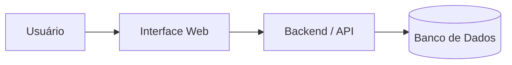

# Architecture — Rifa Digital

Esta seção apresenta a **arquitetura do sistema Rifa Digital**, descrevendo
como o sistema é estruturado e como seus componentes interagem.

A documentação de arquitetura foi organizada para fornecer diferentes níveis
de visão do sistema, desde uma **visão geral** até os **detalhes da arquitetura
de dados**.

---

# Estrutura da Arquitetura

```
architecture
├ README.md
├ system-overview.md
├ c4-model.md
├ system-data-architecture.md
└ data
    ├ README.md
    ├ data-architecture.md
    ├ conceptual
    │   └ mer.md
    ├ logical
    │   └ modelo-relacional.md
    ├ physical
    │   └ schema-sql.md
    └ dictionary
        └ dicionario-dados.md
```

---

# Visão Geral da Arquitetura

A arquitetura do sistema segue uma estrutura típica de aplicações web:



---

# Documentos de Arquitetura

## System Overview

📄 `system-overview.md`

Apresenta uma visão geral do sistema:

- propósito do sistema
- principais funcionalidades
- atores do sistema
- fluxo básico de funcionamento

---

## C4 Model

📄 `c4-model.md`

Descreve a arquitetura utilizando o **modelo C4**, incluindo:

- **System Context** — interação do sistema com usuários
- **Containers** — principais blocos tecnológicos
- **Componentes** — módulos internos do backend

---

## System + Data Architecture

📄 `system-data-architecture.md`

Integra a arquitetura do sistema com a arquitetura de dados,
mostrando como:

- o sistema processa dados
- os dados são armazenados
- a modelagem de dados sustenta o banco

---

# Arquitetura de Dados

A pasta `data/` contém toda a documentação da **modelagem de dados**.

Fluxo da modelagem:

```
MER → Modelo Relacional → SQL → Banco de Dados
```

Documentos disponíveis:

- **Data Architecture** — visão geral da arquitetura de dados
- **MER** — modelo entidade-relacionamento
- **Modelo Relacional** — transformação em tabelas
- **Schema SQL** — implementação do banco
- **Dicionário de Dados** — descrição detalhada dos campos

---

# Relação com Outras Partes da Documentação

A arquitetura se conecta com:

- **Product** — visão do produto
- **UX** — experiência do usuário
- **Requirements** — requisitos do sistema
- **Process** — processo de desenvolvimento
- **Testing** — estratégia de testes

---

# Objetivo da Arquitetura

A documentação de arquitetura tem como objetivos:

- facilitar a compreensão do sistema
- apoiar o desenvolvimento do software
- documentar decisões arquiteturais
- servir como material de apoio para ensino de Engenharia de Software
