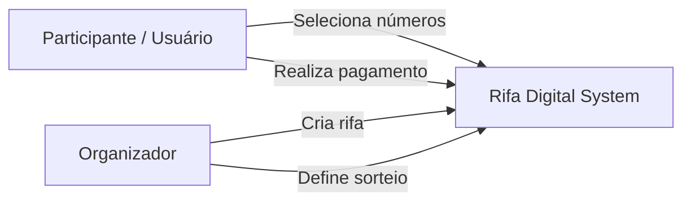
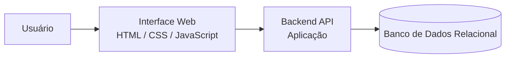
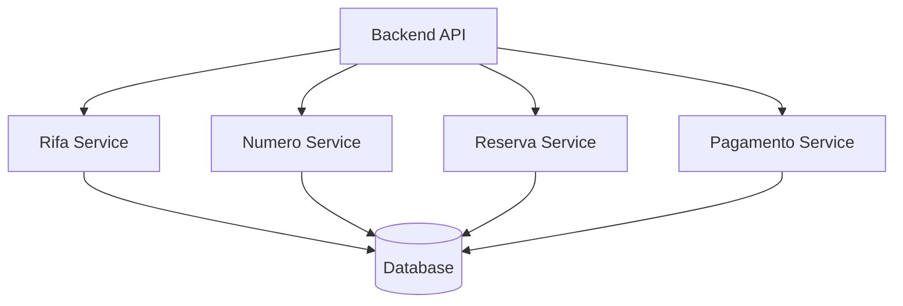

# C4 Model — Rifa Digital

Este documento apresenta a **Arquitetura do Sistema Rifa Digital** utilizando o **modelo C4**.

O modelo C4 descreve a arquitetura de software em diferentes níveis de abstração:

1. Contexto (System Context)
2. Containers
3. Componentes
4. Código (opcional)

Neste documento são apresentados os três primeiros níveis.

---

# 1. System Context

O **System Context Diagram** mostra o sistema como uma caixa única e suas interações com atores externos.

### Atores

**Participante**
- seleciona números
- realiza reserva
- efetua pagamento

**Organizador**
- cria rifas
- define data do sorteio
- acompanha participantes

---

# 2. Container Diagram

O **Container Diagram** mostra os principais blocos tecnológicos do sistema.

### Containers

**Interface Web**
- exibe as rifas
- mostra números disponíveis
- permite reserva de números

**Backend / API**
- implementa regras de negócio
- valida reservas
- processa pagamentos

**Banco de Dados**
- armazena rifas
- armazena números
- registra reservas
- registra pagamentos

---

# 3. Component Diagram

O **Component Diagram** detalha os módulos do backend.

### Componentes

**Rifa Service**
- criação de rifas
- gerenciamento de campanhas

**Numero Service**
- geração de números
- controle de disponibilidade

**Reserva Service**
- reserva de números
- associação com participantes

**Pagamento Service**
- registro de pagamentos
- confirmação de reserva

---

# 4. Relação com Arquitetura de Dados

Os componentes do sistema manipulam as seguintes entidades:

- RIFA
- NUMERO
- PARTICIPANTE
- RESERVA
- PAGAMENTO

Essas entidades são definidas na **Arquitetura de Dados**:

MER → Modelo Relacional → SQL

---

# 5. Integração com a Documentação

Este documento se conecta com:

- System Overview — visão geral do sistema
- System + Data Architecture — integração sistema + dados
- Data Architecture — modelagem de dados
- Testing — estratégia de testes

---

# Conclusão

O modelo C4 ajuda a entender a arquitetura do sistema em diferentes níveis:

Contexto → Containers → Componentes

Essa abordagem facilita:

- comunicação entre equipes
- documentação da arquitetura
- evolução do sistema
