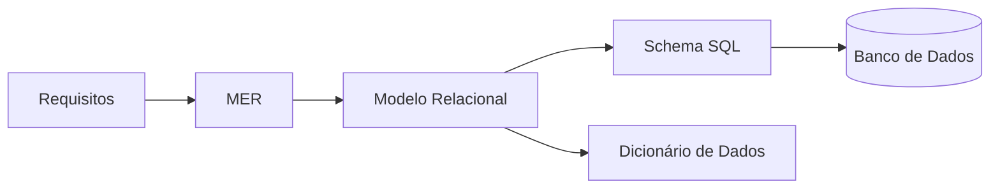

# Data Architecture — Rifa Digital

Esta pasta contém toda a **documentação de arquitetura de dados** do sistema **Rifa Digital**.

A organização segue as etapas clássicas da **modelagem de banco de dados** utilizadas em Engenharia de Software e disciplinas de Banco de Dados.

---

# Estrutura da Arquitetura de Dados

```
data
├ data-architecture.md
├ conceptual
│   └ mer.md
├ logical
│   └ modelo-relacional.md
├ physical
│   └ schema-sql.md
└ dictionary
    └ dicionario-dados.md
```

---

# Visão Geral do Processo

A modelagem de dados segue o fluxo:



---

# Documentos da Arquitetura de Dados

## 1. Data Architecture

📄 `data-architecture.md`

Apresenta a **visão geral da arquitetura de dados**, explicando como os dados evoluem desde os requisitos até o banco de dados.

---

## 2. Modelo Conceitual

📄 `conceptual/mer.md`

Contém o **Modelo Entidade‑Relacionamento (MER)** do sistema.

Define:

- entidades
- atributos
- relacionamentos
- cardinalidade

---

## 3. Modelo Lógico

📄 `logical/modelo-relacional.md`

Transforma o MER em **tabelas relacionais**.

Define:

- tabelas
- chaves primárias
- chaves estrangeiras
- relacionamentos entre tabelas

---

## 4. Modelo Físico

📄 `physical/schema-sql.md`

Apresenta o **schema SQL (DDL)** responsável pela criação do banco de dados.

Define:

- tabelas
- tipos de dados
- constraints
- índices

---

## 5. Dicionário de Dados

📄 `dictionary/dicionario-dados.md`

Documenta todos os **campos das tabelas do banco**.

Inclui:

- nome do campo
- tipo
- descrição
- obrigatoriedade

---

# Fluxo da Modelagem de Dados

A arquitetura segue o fluxo clássico:

```
MER → Modelo Relacional → SQL → Banco de Dados
```

Esse processo garante:

- organização da estrutura de dados
- integridade das informações
- facilidade de manutenção do sistema

---

# Objetivo Educacional

Esta documentação foi estruturada para demonstrar o **processo completo de modelagem de dados**, sendo útil para:

- ensino de Banco de Dados
- compreensão da arquitetura do sistema
- documentação técnica do projeto
