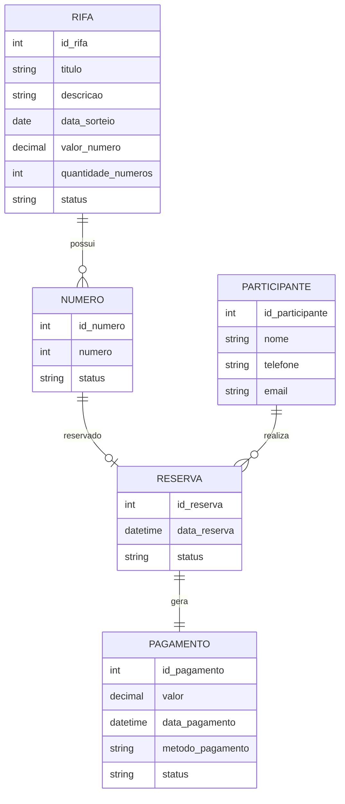

# Modelo Entidade-Relacionamento (MER) — Rifa Digital

Este documento apresenta o **Modelo Entidade-Relacionamento (MER)** do sistema **Rifa Digital**.

O modelo conceitual descreve as **entidades, atributos e relacionamentos** do sistema, sem considerar ainda detalhes de implementação do banco de dados.

---

# 1. Objetivo do Modelo

O MER tem como objetivo representar:

- as **entidades principais do sistema**
- os **atributos de cada entidade**
- os **relacionamentos entre entidades**
- as **cardinalidades dos relacionamentos**

Este modelo corresponde ao **nível conceitual da modelagem de dados**.

---

# 2. Entidades do Sistema

O sistema Rifa Digital possui as seguintes entidades principais:

- **RIFA**
- **NUMERO**
- **PARTICIPANTE**
- **RESERVA**
- **PAGAMENTO**

---

# 3. Descrição das Entidades

## 3.1 RIFA

Representa uma campanha de rifa.

**Atributos:**

- id_rifa (identificador)
- titulo
- descricao
- data_sorteio
- valor_numero
- quantidade_numeros
- status

---

## 3.2 NUMERO

Representa um número disponível para participação na rifa.

**Atributos:**

- id_numero
- numero
- status
- id_rifa

Status possíveis:

- disponível
- reservado
- pago

---

## 3.3 PARTICIPANTE

Representa uma pessoa que participa da rifa.

**Atributos:**

- id_participante
- nome
- telefone
- email

---

## 3.4 RESERVA

Representa a reserva de um número por um participante.

**Atributos:**

- id_reserva
- data_reserva
- status
- id_numero
- id_participante

---

## 3.5 PAGAMENTO

Representa o pagamento realizado para confirmar a participação.

**Atributos:**

- id_pagamento
- valor
- data_pagamento
- metodo_pagamento
- status
- id_reserva

---

# 4. Relacionamentos

Os relacionamentos entre as entidades são:

| Entidade A | Relacionamento | Entidade B | Cardinalidade |
|-------------|---------------|-------------|---------------|
| RIFA | possui | NUMERO | 1 : N |
| NUMERO | pode gerar | RESERVA | 1 : 0..1 |
| PARTICIPANTE | realiza | RESERVA | 1 : N |
| RESERVA | gera | PAGAMENTO | 1 : 1 |

---

# 5. Diagrama Entidade-Relacionamento

O diagrama abaixo representa o modelo conceitual utilizando notação de entidade-relacionamento.

---

# 6. Regras de Negócio

O modelo segue as seguintes regras:

1. Uma **rifa possui vários números**.
2. Cada **número pertence a apenas uma rifa**.
3. Um **participante pode reservar vários números**.
4. Um **número pode ser reservado apenas uma vez**.
5. Cada **reserva gera exatamente um pagamento**.

---

# 7. Nível da Modelagem

Este modelo corresponde ao:

**Modelo Conceitual de Dados**

Fluxo da modelagem no projeto:

MER → Modelo Relacional → SQL → Banco de Dados

---

# 8. Próximos Passos

A partir do MER são derivados:

- **Modelo Relacional**
- **Script SQL do banco de dados**
- **Dicionário de dados**

Esses artefatos fazem parte da arquitetura de dados do sistema.
