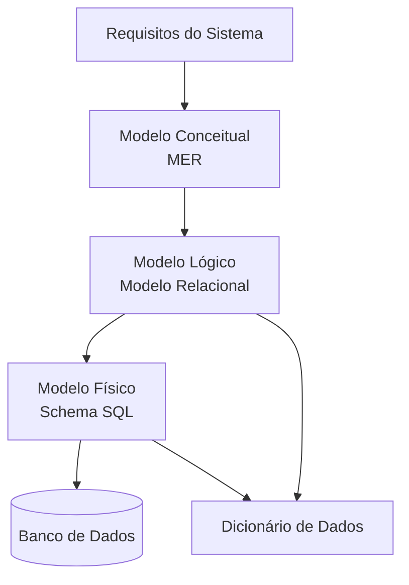
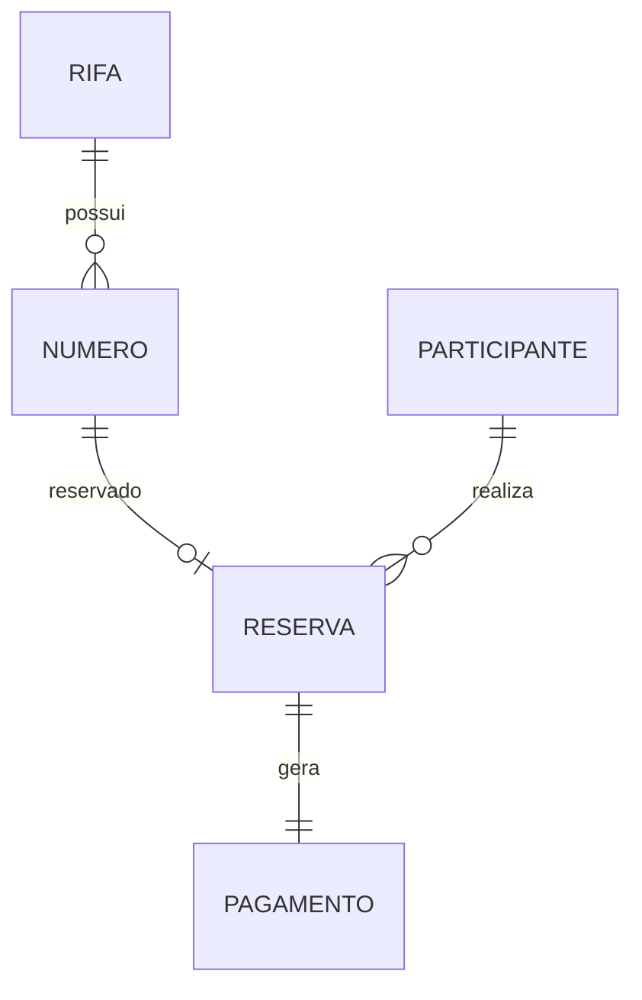

# Data Architecture — Rifa Digital

Este documento apresenta a **Arquitetura de Dados** do sistema **Rifa Digital**.

Ele descreve como os dados do sistema são modelados desde o entendimento do domínio até a implementação do banco de dados.

A modelagem segue o processo clássico da **Engenharia de Banco de Dados**:

1. Modelo Conceitual — MER
2. Modelo Lógico — Modelo Relacional
3. Modelo Físico — SQL
4. Dicionário de Dados

---

# Visão Geral da Arquitetura de Dados



---

# 1. Requisitos de Dados

O primeiro passo da modelagem consiste em entender os **dados necessários para o sistema**.

Para o sistema **Rifa Digital**, os principais conceitos identificados são:

- Rifa
- Número
- Participante
- Reserva
- Pagamento

Esses conceitos representam as **entidades do domínio do sistema**.

---

# 2. Modelo Conceitual — MER

O **Modelo Entidade-Relacionamento (MER)** representa os dados de forma conceitual.

Neste nível são definidos:

- entidades
- atributos
- relacionamentos
- cardinalidade

### Entidades

- RIFA
- NUMERO
- PARTICIPANTE
- RESERVA
- PAGAMENTO

### Diagrama MER



Relacionamentos principais:

```
RIFA 1 ---- N NUMERO
NUMERO 1 ---- 0..1 RESERVA
PARTICIPANTE 1 ---- N RESERVA
RESERVA 1 ---- 1 PAGAMENTO
```

---

# 3. Modelo Lógico — Modelo Relacional

O **Modelo Relacional** transforma o MER em **tabelas relacionais**.

Cada entidade se torna uma tabela.

### Estrutura das tabelas

```
RIFA(
 id_rifa PK,
 titulo,
 data_sorteio,
 valor_numero
)

NUMERO(
 id_numero PK,
 numero,
 status,
 id_rifa FK
)

PARTICIPANTE(
 id_participante PK,
 nome,
 telefone,
 email
)

RESERVA(
 id_reserva PK,
 id_numero FK,
 id_participante FK,
 data_reserva
)

PAGAMENTO(
 id_pagamento PK,
 id_reserva FK,
 valor,
 status
)
```

Neste nível aparecem:

- **Primary Keys (PK)**
- **Foreign Keys (FK)**
- integridade referencial

---

# 4. Modelo Físico — SQL

O modelo físico representa a **implementação real do banco de dados**.

Exemplo de criação de tabelas:

```sql
CREATE TABLE rifa (
 id_rifa INT PRIMARY KEY,
 titulo VARCHAR(150),
 data_sorteio DATE,
 valor_numero DECIMAL(10,2)
);

CREATE TABLE numero (
 id_numero INT PRIMARY KEY,
 numero INT,
 status VARCHAR(20),
 id_rifa INT,
 FOREIGN KEY (id_rifa) REFERENCES rifa(id_rifa)
);
```

Aqui são definidos:

- tipos de dados
- constraints
- integridade referencial
- índices

---

# 5. Dicionário de Dados

O **Dicionário de Dados** descreve cada campo das tabelas.

Ele inclui:

- nome do campo
- tipo de dado
- descrição
- obrigatoriedade

Exemplo:

| Tabela | Campo | Tipo | Descrição |
|------|------|------|------|
| RIFA | id_rifa | INT | Identificador da rifa |
| RIFA | titulo | VARCHAR | Nome da rifa |
| NUMERO | numero | INT | Número da rifa |
| RESERVA | data_reserva | DATETIME | Data da reserva |

O dicionário de dados facilita:

- entendimento do banco
- manutenção do sistema
- integração entre sistemas

---

# Fluxo Completo da Modelagem

A arquitetura de dados segue a sequência:

```
Requisitos
    ↓
MER (Modelo Conceitual)
    ↓
Modelo Relacional (Modelo Lógico)
    ↓
Schema SQL (Modelo Físico)
    ↓
Banco de Dados
```

Esse fluxo representa o processo completo de **engenharia de dados em bancos relacionais**.

---

# Conclusão

A arquitetura de dados garante:

- organização das informações
- integridade dos dados
- consistência entre tabelas
- facilidade de manutenção

A separação entre **MER, Modelo Relacional e SQL** permite evoluir o sistema de forma estruturada e segura.
