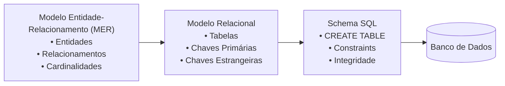

# Evolução da Modelagem de Dados

Este documento apresenta a evolução da modelagem de dados utilizada no
sistema **Rifa Digital**, mostrando a transformação do modelo conceitual
até a implementação física no banco de dados.

A modelagem segue as etapas clássicas da engenharia de banco de dados:

1. Modelo Conceitual (MER)
2. Modelo Lógico (Relacional)
3. Modelo Físico (SQL)
4. Banco de Dados Implementado

---

# Fluxo da Modelagem



---

# 1. Modelo Conceitual — MER

O **Modelo Entidade-Relacionamento** representa o domínio do problema de
forma conceitual.

Elementos principais:

- Entidades
- Atributos
- Relacionamentos
- Cardinalidades

Exemplo de entidades do sistema:

- Rifa
- Número
- Participante
- Reserva
- Pagamento

Documento relacionado:

`conceptual/mer.md`

---

# 2. Modelo Lógico — Modelo Relacional

O **Modelo Relacional** transforma o MER em estruturas de banco de dados.

Transformações principais:

| MER | Modelo Relacional |
|----|----|
| Entidade | Tabela |
| Atributo | Coluna |
| Identificador | Chave Primária |
| Relacionamento | Chave Estrangeira |

Documento relacionado:

`logical/modelo-relacional.md`

---

# 3. Modelo Físico — SQL

No modelo físico o banco é implementado usando **SQL**.

Exemplo de estrutura:

```sql
CREATE TABLE rifa (
    id_rifa INT PRIMARY KEY,
    titulo VARCHAR(100),
    descricao TEXT,
    valor_numero DECIMAL(10,2),
    data_sorteio DATE
);
```

Documento relacionado:

`physical/schema-sql.md`

---

# 4. Banco de Dados

Após a criação do schema SQL, o banco de dados passa a armazenar
as informações do sistema.

O banco de dados do **Rifa Digital** armazena:

- rifas
- números disponíveis
- participantes
- reservas
- pagamentos
- resultados de sorteio

---

# Relação com Outros Documentos

Esta evolução está documentada nos seguintes arquivos:

| Documento | Descrição |
|-----------|-----------|
| mer.md | modelo entidade-relacionamento |
| modelo-relacional.md | modelo relacional |
| schema-sql.md | implementação SQL |
| dicionario-dados.md | descrição dos campos |

---

# Benefícios dessa Estrutura

Essa abordagem permite:

- compreensão progressiva da modelagem
- rastreabilidade entre modelos
- documentação clara da arquitetura de dados
- apoio didático para ensino de banco de dados
