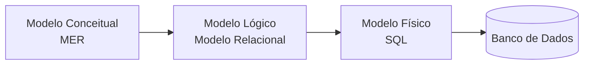
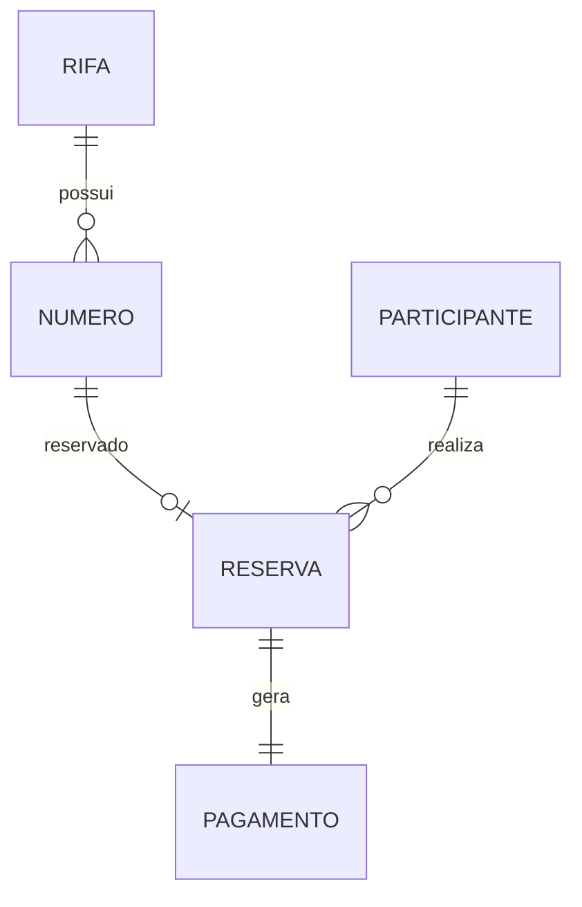
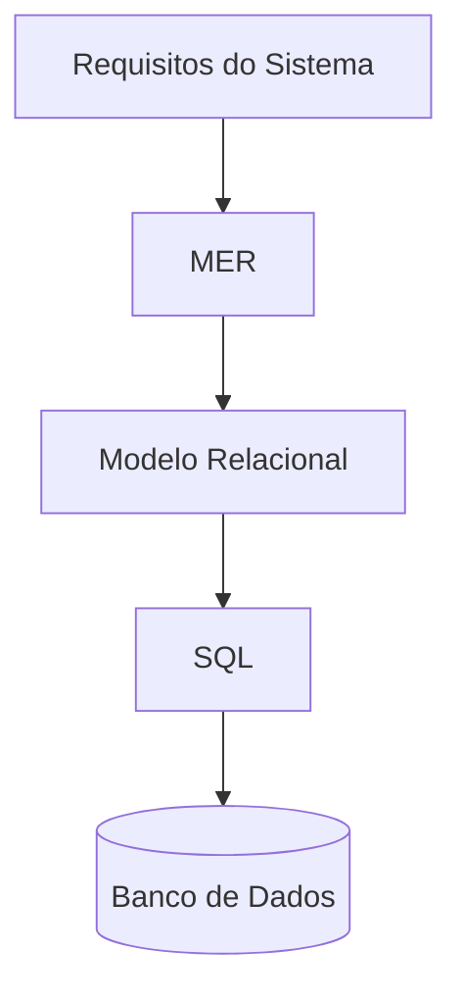

# Database Design — Rifa Digital

Este documento apresenta o **processo de modelagem de dados** do sistema **Rifa Digital**.

Ele demonstra como um banco de dados é projetado em três etapas principais:

1. **Modelo Conceitual — MER**
2. **Modelo Lógico — Modelo Relacional**
3. **Modelo Físico — SQL (DDL)**

Esse fluxo corresponde ao processo clássico de **engenharia de banco de dados**.

---

# Visão Geral da Modelagem



---

# 1. Modelo Conceitual — MER

O **Modelo Entidade‑Relacionamento** descreve:

- entidades
- atributos
- relacionamentos
- cardinalidades

Neste nível **não existem tabelas**, apenas conceitos.

### Entidades do sistema

- RIFA
- NUMERO
- PARTICIPANTE
- RESERVA
- PAGAMENTO

### Diagrama MER



---

# 2. Modelo Lógico — Modelo Relacional

O modelo relacional transforma as entidades em **tabelas**.

### Tabelas

```
RIFA(
 id_rifa PK,
 titulo,
 data_sorteio,
 valor_numero
)

NUMERO(
 id_numero PK,
 numero,
 status,
 id_rifa FK
)

PARTICIPANTE(
 id_participante PK,
 nome,
 telefone
)

RESERVA(
 id_reserva PK,
 id_numero FK,
 id_participante FK
)

PAGAMENTO(
 id_pagamento PK,
 id_reserva FK
)
```

Neste nível aparecem:

- **Primary Keys (PK)**
- **Foreign Keys (FK)**
- relacionamentos entre tabelas

---

# 3. Modelo Físico — SQL

O modelo físico representa a implementação no banco.

### Exemplo SQL

```sql
CREATE TABLE rifa (
  id_rifa INT PRIMARY KEY,
  titulo VARCHAR(150),
  data_sorteio DATE,
  valor_numero DECIMAL(10,2)
);

CREATE TABLE numero (
  id_numero INT PRIMARY KEY,
  numero INT,
  status VARCHAR(20),
  id_rifa INT,
  FOREIGN KEY (id_rifa) REFERENCES rifa(id_rifa)
);
```

Aqui definimos:

- tipos de dados
- constraints
- índices
- integridade referencial

---

# Comparação dos Modelos

| Nível | Modelo | Objetivo |
|------|------|------|
| Conceitual | MER | Entender o domínio do problema |
| Lógico | Modelo Relacional | Estruturar tabelas |
| Físico | SQL | Implementar no banco de dados |

---

# Fluxo Completo da Modelagem



---

# Conclusão

A modelagem de dados segue uma evolução:

```
MER → Modelo Relacional → SQL → Banco de Dados
```

Essa abordagem permite:

- melhor entendimento do domínio
- organização correta dos dados
- implementação segura no banco de dados
