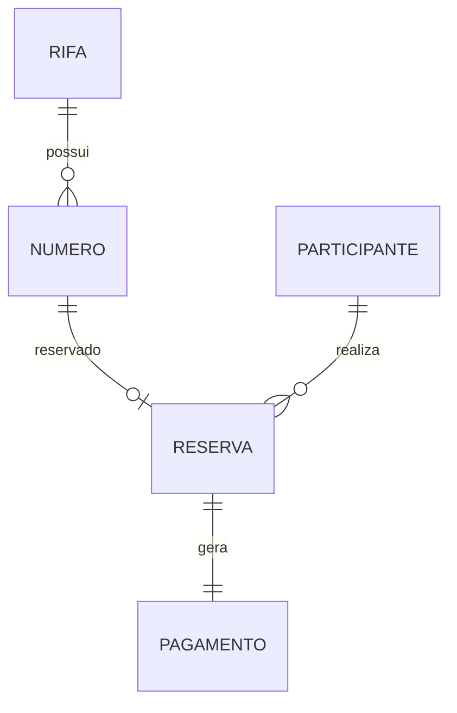

# Modelo Relacional — Rifa Digital

Este documento apresenta o **Modelo Relacional** do sistema **Rifa Digital**.

O modelo relacional corresponde ao **nível lógico da modelagem de dados**, derivado do Modelo Entidade‑Relacionamento (MER).  
Neste nível, as entidades são transformadas em **tabelas**, e os relacionamentos são representados através de **chaves primárias (PK)** e **chaves estrangeiras (FK)**.

---

# 1. Objetivo do Modelo Relacional

O modelo relacional define:

- tabelas do banco de dados
- atributos de cada tabela
- chaves primárias
- chaves estrangeiras
- relacionamentos entre tabelas

Este modelo serve como base para a criação do **schema SQL do banco de dados**.

---

# 2. Tabelas do Sistema

O banco de dados do sistema **Rifa Digital** é composto pelas seguintes tabelas:

- RIFA
- NUMERO
- PARTICIPANTE
- RESERVA
- PAGAMENTO

---

# 3. Estrutura das Tabelas

## 3.1 Tabela RIFA

Representa uma campanha de rifa.

```
RIFA(
  id_rifa PK,
  titulo,
  descricao,
  data_sorteio,
  valor_numero,
  quantidade_numeros,
  status
)
```

Descrição:

| Campo | Tipo | Descrição |
|------|------|-----------|
| id_rifa | inteiro | Identificador da rifa |
| titulo | texto | Nome da rifa |
| descricao | texto | Descrição da campanha |
| data_sorteio | data | Data do sorteio |
| valor_numero | decimal | Valor de cada número |
| quantidade_numeros | inteiro | Quantidade de números disponíveis |
| status | texto | Situação da rifa |

---

## 3.2 Tabela NUMERO

Representa os números disponíveis em uma rifa.

```
NUMERO(
  id_numero PK,
  numero,
  status,
  id_rifa FK
)
```

Descrição:

| Campo | Tipo | Descrição |
|------|------|-----------|
| id_numero | inteiro | Identificador do número |
| numero | inteiro | Número da rifa |
| status | texto | Situação do número |
| id_rifa | inteiro | Rifa à qual o número pertence |

Relacionamento:

```
RIFA 1 ---- N NUMERO
```

---

## 3.3 Tabela PARTICIPANTE

Representa um usuário que participa da rifa.

```
PARTICIPANTE(
  id_participante PK,
  nome,
  telefone,
  email
)
```

Descrição:

| Campo | Tipo | Descrição |
|------|------|-----------|
| id_participante | inteiro | Identificador do participante |
| nome | texto | Nome do participante |
| telefone | texto | Telefone para contato |
| email | texto | Email do participante |

---

## 3.4 Tabela RESERVA

Representa a reserva de um número por um participante.

```
RESERVA(
  id_reserva PK,
  data_reserva,
  status,
  id_numero FK,
  id_participante FK
)
```

Descrição:

| Campo | Tipo | Descrição |
|------|------|-----------|
| id_reserva | inteiro | Identificador da reserva |
| data_reserva | data/hora | Data da reserva |
| status | texto | Status da reserva |
| id_numero | inteiro | Número reservado |
| id_participante | inteiro | Participante que reservou |

Relacionamentos:

```
NUMERO 1 ---- 0..1 RESERVA
PARTICIPANTE 1 ---- N RESERVA
```

---

## 3.5 Tabela PAGAMENTO

Representa o pagamento de uma reserva.

```
PAGAMENTO(
  id_pagamento PK,
  valor,
  data_pagamento,
  metodo_pagamento,
  status,
  id_reserva FK
)
```

Descrição:

| Campo | Tipo | Descrição |
|------|------|-----------|
| id_pagamento | inteiro | Identificador do pagamento |
| valor | decimal | Valor pago |
| data_pagamento | data/hora | Data do pagamento |
| metodo_pagamento | texto | Forma de pagamento |
| status | texto | Status do pagamento |
| id_reserva | inteiro | Reserva associada |

Relacionamento:

```
RESERVA 1 ---- 1 PAGAMENTO
```

---

# 4. Diagrama do Modelo Relacional



---

# 5. Integridade Referencial

O modelo relacional utiliza **chaves estrangeiras** para garantir integridade entre tabelas.

Principais relacionamentos:

- NUMERO.id_rifa → RIFA.id_rifa
- RESERVA.id_numero → NUMERO.id_numero
- RESERVA.id_participante → PARTICIPANTE.id_participante
- PAGAMENTO.id_reserva → RESERVA.id_reserva

---

# 6. Normalização

O modelo foi estruturado considerando princípios de normalização:

- eliminação de redundâncias
- separação de entidades independentes
- uso de chaves primárias
- uso de chaves estrangeiras

O modelo atende aos princípios da **3ª Forma Normal (3FN)**.

---

# 7. Próxima Etapa da Modelagem

A partir do **Modelo Relacional**, é possível gerar:

- o **script SQL de criação das tabelas**
- índices e constraints
- o banco de dados físico

Fluxo de modelagem do sistema:

```
MER
↓
Modelo Relacional
↓
SQL (DDL)
↓
Banco de Dados
```
