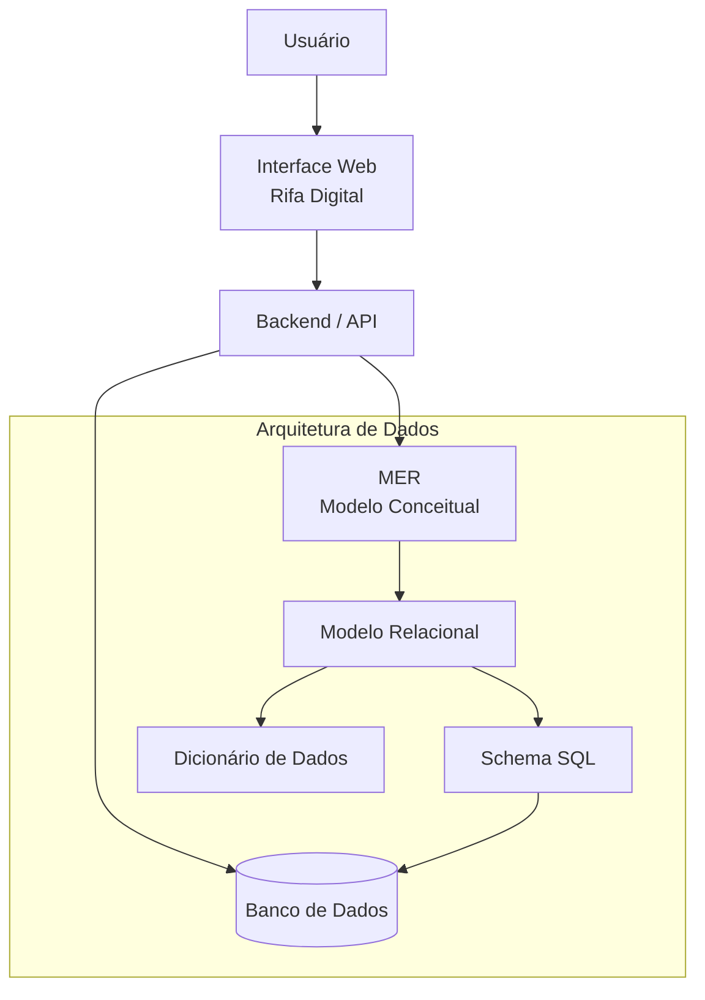

# System + Data Architecture — Rifa Digital

Este documento apresenta uma visão integrada da **Arquitetura do Sistema** e da **Arquitetura de Dados** do projeto **Rifa Digital**.

O objetivo é mostrar como:

- os **usuários interagem com o sistema**
- a **aplicação processa os dados**
- os **dados são armazenados no banco**
- a **modelagem de dados sustenta o banco de dados**

Essa visão conecta **arquitetura de software** com **arquitetura de dados**.

---

# Visão Geral da Arquitetura



---

# 1. Usuário

O **usuário** interage com o sistema através da interface web.

Exemplos de ações:

- visualizar uma rifa
- escolher números disponíveis
- reservar números
- confirmar pagamento

---

# 2. Interface Web

A interface web é responsável por:

- apresentar informações da rifa
- mostrar números disponíveis
- permitir seleção de números
- enviar dados para o backend

Exemplos de páginas:

- lista de rifas
- página da rifa
- confirmação de reserva

---

# 3. Backend / API

O **backend** implementa as regras de negócio.

Responsabilidades:

- validar reservas
- registrar participantes
- processar pagamentos
- atualizar status dos números

O backend também realiza:

- consultas ao banco de dados
- inserção de registros
- atualização de status

---

# 4. Banco de Dados

O banco de dados armazena as informações do sistema.

Principais tabelas:

- RIFA
- NUMERO
- PARTICIPANTE
- RESERVA
- PAGAMENTO

Essas tabelas foram definidas através da **modelagem de dados**.

---

# 5. Arquitetura de Dados

A arquitetura de dados define como os dados são estruturados antes de serem implementados no banco.

O processo segue três níveis principais de modelagem.

---

# 6. Modelo Conceitual (MER)

O **Modelo Entidade-Relacionamento (MER)** representa os dados de forma conceitual.

Define:

- entidades
- atributos
- relacionamentos
- cardinalidade

Entidades do sistema:

- RIFA
- NUMERO
- PARTICIPANTE
- RESERVA
- PAGAMENTO

---

# 7. Modelo Lógico (Modelo Relacional)

O modelo lógico transforma o MER em **tabelas relacionais**.

Cada entidade torna-se uma tabela.

Exemplo:

```
RIFA(
 id_rifa PK,
 titulo,
 data_sorteio,
 valor_numero
)

NUMERO(
 id_numero PK,
 numero,
 status,
 id_rifa FK
)
```

Neste nível aparecem:

- chaves primárias (PK)
- chaves estrangeiras (FK)
- relacionamentos entre tabelas

---

# 8. Modelo Físico (SQL)

O modelo físico representa a **implementação real do banco**.

Exemplo:

```sql
CREATE TABLE rifa (
 id_rifa INT PRIMARY KEY,
 titulo VARCHAR(150),
 data_sorteio DATE,
 valor_numero DECIMAL(10,2)
);
```

Aqui são definidos:

- tipos de dados
- constraints
- integridade referencial
- índices

---

# 9. Dicionário de Dados

O dicionário de dados documenta cada campo do banco.

Ele descreve:

- nome do campo
- tipo de dado
- significado do campo
- obrigatoriedade

Exemplo:

| Tabela | Campo | Tipo | Descrição |
|------|------|------|------|
| RIFA | id_rifa | INT | Identificador da rifa |
| NUMERO | numero | INT | Número da rifa |
| RESERVA | data_reserva | DATETIME | Data da reserva |

---

# Fluxo Completo do Sistema

O funcionamento completo do sistema pode ser representado como:

```
Usuário
   ↓
Interface Web
   ↓
Backend / API
   ↓
Banco de Dados
```

A estrutura do banco é resultado do processo de modelagem:

```
MER → Modelo Relacional → SQL → Banco de Dados
```

---

# Conclusão

A integração entre **arquitetura de sistema** e **arquitetura de dados** permite:

- melhor organização do sistema
- maior consistência dos dados
- facilidade de evolução da aplicação
- melhor compreensão do funcionamento do sistema

Esse modelo também facilita a documentação técnica e o ensino de conceitos de **Engenharia de Software e Banco de Dados**.
