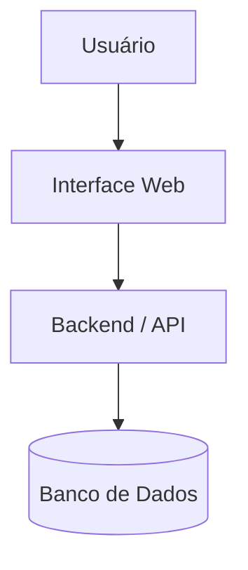

# System Overview — Rifa Digital

Este documento apresenta uma **visão geral do sistema Rifa Digital**, descrevendo seus principais objetivos, componentes e fluxo de funcionamento.

O objetivo do *System Overview* é fornecer uma compreensão rápida de:

- propósito do sistema
- principais funcionalidades
- componentes da arquitetura
- interação entre usuários e sistema

---

# 1. Visão Geral do Sistema

O **Rifa Digital** é um sistema web que permite a criação e gestão de rifas online.

O sistema possibilita:

- criação de campanhas de rifa
- geração de números da rifa
- reserva de números por participantes
- registro de pagamento
- realização de sorteio

---

# 2. Objetivo do Sistema

O sistema tem como objetivo facilitar a **organização e gestão de rifas digitais**, permitindo que organizadores e participantes interajam de forma simples e segura.

Benefícios:

- organização automática dos números
- controle de reservas
- registro de pagamentos
- transparência no processo de sorteio

---

# 3. Atores do Sistema

Os principais atores do sistema são:

### Organizador

Responsável por:

- criar a rifa
- definir valor dos números
- definir data do sorteio

### Participante

Responsável por:

- escolher números
- realizar reserva
- efetuar pagamento

---

# 4. Componentes do Sistema

O sistema é composto por três principais camadas:

- Interface Web
- Backend / API
- Banco de Dados

---

# 5. Arquitetura Simplificada



---

# 6. Principais Funcionalidades

O sistema oferece as seguintes funcionalidades:

### Gestão de Rifas

- criação de rifas
- definição de data de sorteio
- definição do valor do número

### Gestão de Números

- geração automática de números
- visualização de números disponíveis
- atualização de status

### Participação

- seleção de números
- reserva de números
- confirmação de pagamento

### Pagamentos

- registro de pagamento
- atualização do status da reserva

### Sorteio

- identificação do número vencedor
- associação do vencedor ao participante

---

# 7. Fluxo Básico de Uso

O fluxo principal do sistema ocorre da seguinte forma:

```
Organizador cria rifa
        ↓
Sistema gera números da rifa
        ↓
Participante escolhe números
        ↓
Participante reserva números
        ↓
Participante realiza pagamento
        ↓
Sistema confirma reserva
        ↓
Realização do sorteio
```

---

# 8. Estrutura de Dados do Sistema

Os dados do sistema são organizados nas seguintes entidades principais:

- RIFA
- NUMERO
- PARTICIPANTE
- RESERVA
- PAGAMENTO

Essas entidades são modeladas através de:

```
MER → Modelo Relacional → SQL
```

---

# 9. Integração com a Arquitetura

O System Overview se conecta com outros documentos da arquitetura:

- **C4 Model** — visão estrutural do sistema
- **System + Data Architecture** — integração entre sistema e dados
- **Data Architecture** — modelagem de dados
- **Testing** — estratégia de testes

---

# 10. Conclusão

O sistema **Rifa Digital** demonstra um exemplo completo de aplicação web com:

- interface de usuário
- backend de processamento
- banco de dados relacional

A documentação foi estruturada para apoiar:

- compreensão do sistema
- ensino de engenharia de software
- ensino de banco de dados
