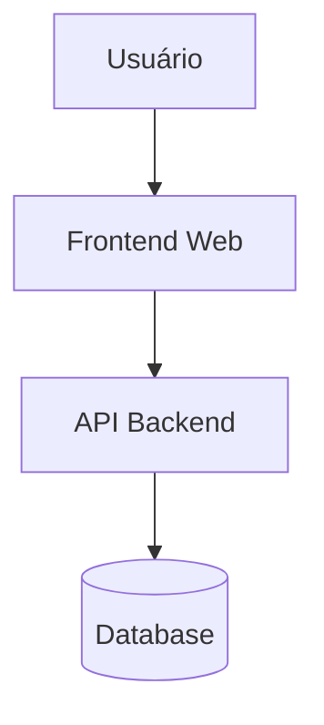
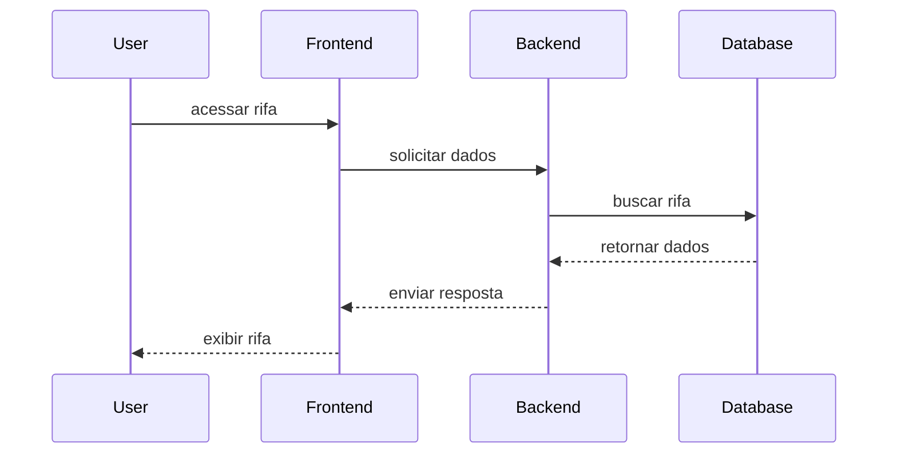

# Architecture Explorer

O **Architecture Explorer** permite navegar pela arquitetura do sistema **Rifa Digital**,
identificando os principais componentes, serviços e suas relações.

Este documento complementa os diagramas UML e o modelo C4 presentes na documentação.

---

## Visão Geral da Arquitetura

A arquitetura do sistema segue uma estrutura típica de aplicações web:

---

## Camadas da Arquitetura

### 1. Interface do Usuário

Responsável pela interação com o usuário.

Principais responsabilidades:

- Exibir rifas disponíveis
- Permitir compra de números
- Exibir resultados de sorteios

---

### 2. Backend / API

Responsável pela lógica de negócio.

Principais responsabilidades:

- gerenciamento de rifas
- controle de números vendidos
- execução de sorteios
- integração com banco de dados

---

### 3. Banco de Dados

Responsável pela persistência das informações do sistema.

Principais entidades:

- RIFA
- NUMERO
- PARTICIPANTE
- PAGAMENTO

---

## Componentes Principais

### RifaService

Responsável por:

- criar rifas
- listar rifas
- controlar estado da rifa

---

### NumeroService

Responsável por:

- gerar números da rifa
- registrar números vendidos
- validar disponibilidade

---

### SorteioService

Responsável por:

- executar o sorteio
- selecionar número vencedor
- registrar resultado

---

## Fluxo de Operação

---

## Relação com Outros Documentos

A arquitetura também pode ser explorada através dos seguintes documentos:

- System Overview
- Component Diagram
- Class Diagram
- Sequence Diagram
- C4 Model

---

## Navegação Relacionada

- [System Overview](../architecture/system-overview.md)
- [Component Diagram](../architecture/component-diagram.md)
- [Class Diagram](../architecture/class-diagram.md)
- [Sequence Diagram](../architecture/sequence-diagram.md)

---

## Objetivo

O objetivo do **Architecture Explorer** é facilitar:

- compreensão da estrutura do sistema
- análise da arquitetura
- navegação entre componentes
- entendimento das interações entre serviços
