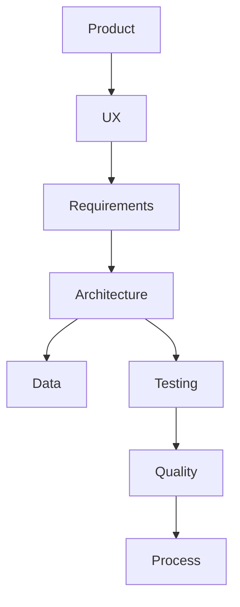
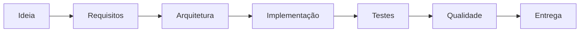

# Engineering Map

O **Engineering Map** apresenta uma visão integrada da engenharia do sistema **Rifa Digital**.
Ele mostra como os diferentes artefatos do projeto se relacionam ao longo do ciclo de engenharia.

---

## Visão Geral

A engenharia do sistema é organizada em camadas:

---

## Camadas da Engenharia

### Product

Define a estratégia do produto.

Documentos principais:

- Visão do Produto
- Stakeholders
- Roadmap

---

### UX

Define a experiência do usuário.

Documentos principais:

- Personas
- Jornada do Usuário
- Fluxos de interação

---

### Requirements

Define as funcionalidades e requisitos do sistema.

Artefatos principais:

- Requisitos funcionais
- Requisitos não funcionais
- Casos de uso
- Priorização
- Rastreabilidade

---

### Architecture

Define a estrutura técnica do sistema.

Artefatos principais:

- System Overview
- Component Diagram
- Class Diagram
- Sequence Diagram
- C4 Model

---

### Data

Define o modelo de dados.

Artefatos principais:

- MER
- Modelo Relacional
- Schema SQL
- Dicionário de Dados

---

### Testing

Define a estratégia de validação do sistema.

Artefatos principais:

- Estratégia de testes
- Plano de testes
- Casos de teste
- BDD scenarios

---

### Quality

Responsável por garantir a qualidade do sistema.

Artefatos principais:

- Plano de qualidade
- Dashboard de qualidade
- Relatórios de execução de testes

---

### Process

Define o processo de desenvolvimento.

Artefatos principais:

- Processo de desenvolvimento
- Métricas de engenharia
- Project Health

---

## Fluxo da Engenharia

---

## Navegação Relacionada

- [Knowledge Graph](knowledge-graph.md)
- [Traceability Graph](traceability-graph.md)
- [Architecture Explorer](architecture-explorer.md)
- [System Atlas](system-atlas.md)
