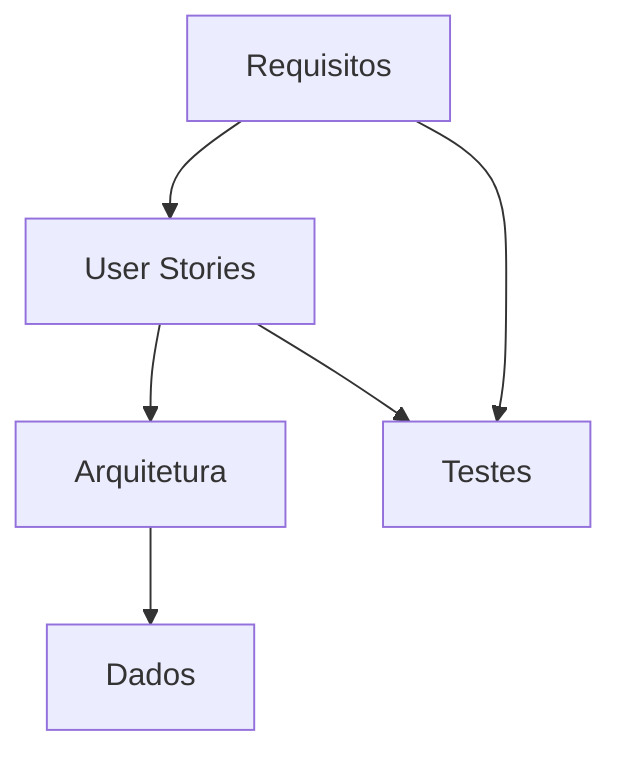
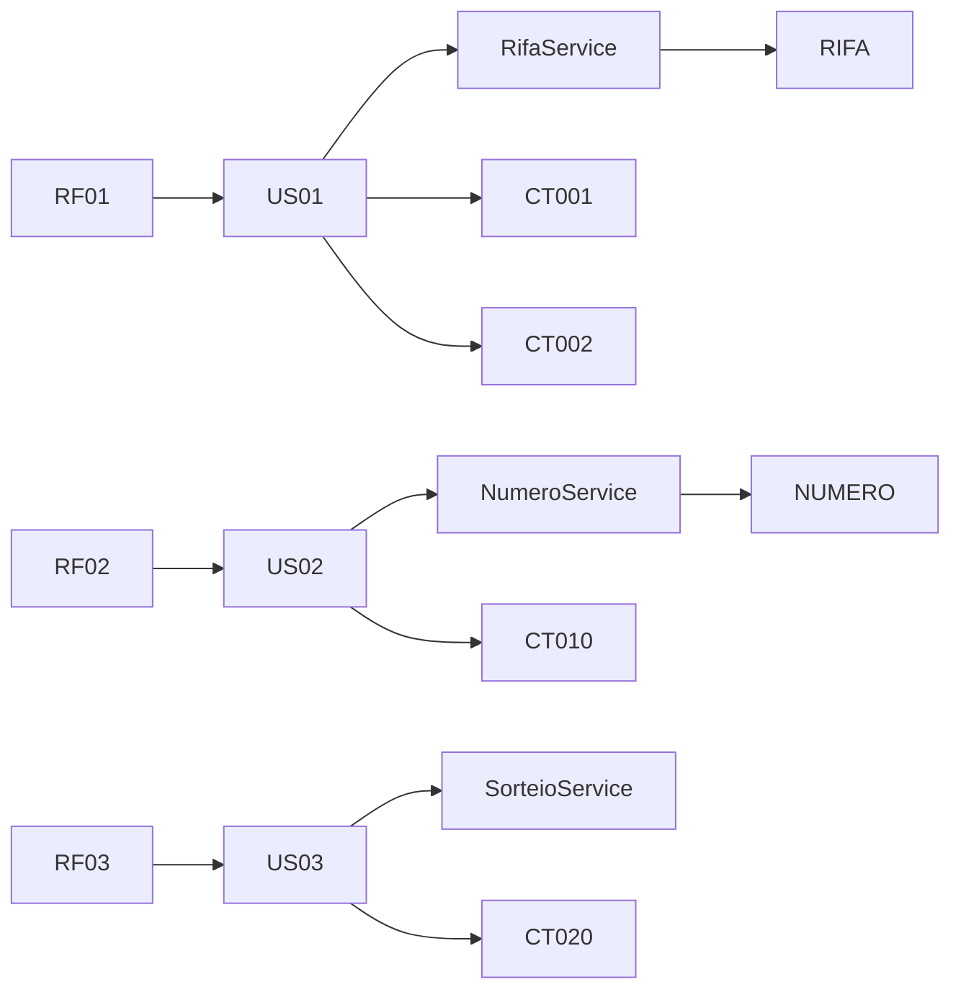

# Knowledge Graph

O **Knowledge Graph de Engenharia** representa as relações entre os artefatos
do sistema **Rifa Digital**.

Ele conecta elementos como:

- requisitos
- user stories
- componentes da arquitetura
- entidades de dados
- casos de teste

O objetivo é permitir **navegação e rastreabilidade entre artefatos da engenharia de software**.

---

## Visão Conceitual

---

## Exemplo de Relações

### Requisitos → User Stories

| Requisito | User Story |
|-----------|------------|
| RF01 Criar rifa | US01 Criar campanha |
| RF02 Comprar número | US02 Reservar número |
| RF03 Realizar sorteio | US03 Executar sorteio |

---

### User Stories → Arquitetura

| User Story | Componente |
|------------|------------|
| US01 Criar campanha | RifaService |
| US02 Reservar número | NumeroService |
| US03 Executar sorteio | SorteioService |

---

### Arquitetura → Dados

| Serviço | Entidade |
|--------|---------|
| RifaService | RIFA |
| NumeroService | NUMERO |
| SorteioService | RESULTADO |

---

### Requisitos → Testes

| Requisito | Caso de Teste |
|----------|---------------|
| RF01 | CT001 |
| RF01 | CT002 |
| RF01 | CT003 |
| RF02 | CT010 |
| RF03 | CT020 |

---

## Visualização do Grafo

---

## Benefícios do Knowledge Graph

O Knowledge Graph permite:

- visualizar relações entre artefatos
- facilitar análise de impacto
- melhorar rastreabilidade
- apoiar auditorias de engenharia

---

## Navegação Relacionada

- [Engineering Map](engineering-map.md)
- [Traceability Graph](traceability-graph.md)
- [Architecture Explorer](architecture-explorer.md)
- [System Atlas](system-atlas.md)
