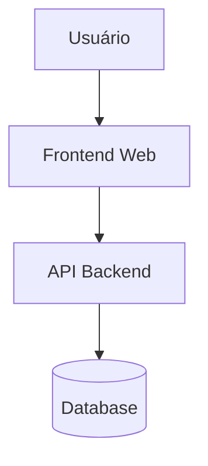
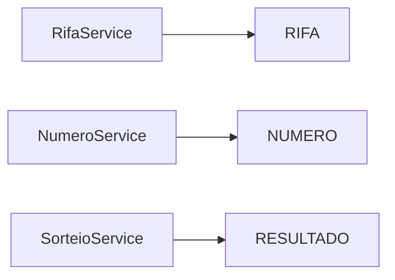

# System Atlas

O **System Atlas** fornece uma visão estruturada de todos os principais elementos
do sistema **Rifa Digital**, permitindo entender como os componentes técnicos,
dados e funcionalidades se organizam.

Ele funciona como um **mapa do sistema**, ajudando desenvolvedores, analistas
e testadores a localizar rapidamente partes da arquitetura.

---

## Visão Geral do Sistema

---

## Componentes Principais

### Frontend

Responsável pela interface do usuário.

Funções principais:

- exibir rifas disponíveis
- permitir compra de números
- exibir resultados de sorteio

---

### Backend

Responsável pela lógica de negócio do sistema.

Principais serviços:

- **RifaService**
- **NumeroService**
- **SorteioService**

---

### Banco de Dados

Responsável pela persistência das informações.

Principais entidades:

- RIFA
- NUMERO
- PARTICIPANTE
- PAGAMENTO
- RESULTADO

---

## Mapa de Serviços

---

## Relação com Requisitos

| Serviço | Requisitos |
|-------|-------------|
| RifaService | RF01 Criar rifa |
| NumeroService | RF02 Comprar número |
| SorteioService | RF03 Realizar sorteio |

---

## Relação com Testes

| Serviço | Testes |
|-------|--------|
| RifaService | CT001, CT002 |
| NumeroService | CT010 |
| SorteioService | CT020 |

---

## Navegação Relacionada

- [Engineering Map](engineering-map.md)
- [Knowledge Graph](knowledge-graph.md)
- [Traceability Graph](traceability-graph.md)
- [Architecture Explorer](architecture-explorer.md)

---

## Objetivo

O **System Atlas** facilita:

- compreensão da arquitetura
- navegação entre serviços
- identificação de dependências
- análise de impacto de mudanças
