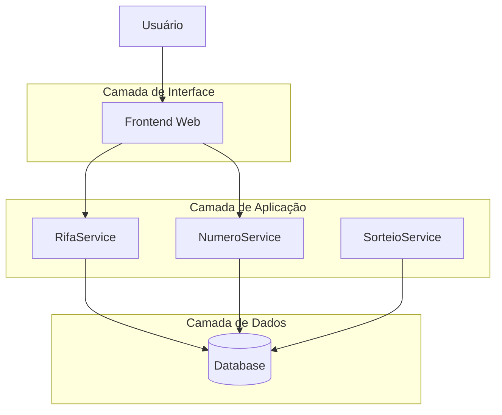
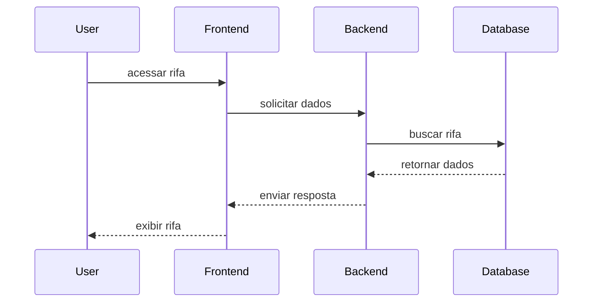

# 3D Architecture Map

O **3D Architecture Map** apresenta uma visualização conceitual da arquitetura
do sistema **Rifa Digital** em camadas, simulando uma visão tridimensional
das partes do sistema.

Essa representação ajuda a entender como:

- usuários interagem com o sistema
- os componentes da aplicação se conectam
- os serviços acessam os dados

---

## Visão Conceitual da Arquitetura

---

## Camadas da Arquitetura

### 1. Camada de Interface

Responsável pela interação com o usuário.

Componentes:

- Frontend Web
- Interface de compra de números
- Visualização de resultados

---

### 2. Camada de Aplicação

Contém a lógica de negócio do sistema.

Serviços principais:

- **RifaService** — gerenciamento das rifas
- **NumeroService** — controle de números disponíveis
- **SorteioService** — execução dos sorteios

---

### 3. Camada de Dados

Responsável pela persistência das informações.

Principais entidades:

- RIFA
- NUMERO
- PARTICIPANTE
- PAGAMENTO
- RESULTADO

---

## Fluxo de Interação

---

## Navegação Relacionada

- [Engineering Map](engineering-map.md)
- [Knowledge Graph](knowledge-graph.md)
- [System Atlas](system-atlas.md)
- [Architecture Explorer](architecture-explorer.md)

---

## Objetivo

O **3D Architecture Map** facilita:

- visualização das camadas do sistema
- entendimento das dependências entre componentes
- análise arquitetural
- comunicação da arquitetura para equipes técnicas
