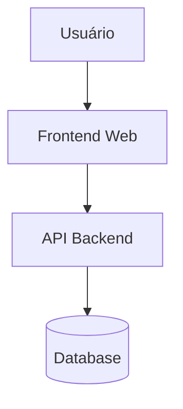
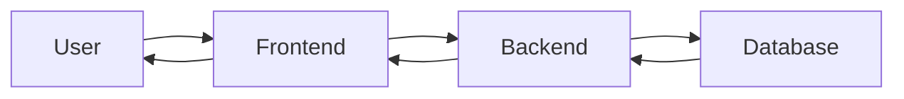

# Interactive System Map

O **System Map** apresenta uma visão simplificada da estrutura do sistema **Rifa Digital**,
mostrando os principais elementos e suas relações.

Ele funciona como um mapa conceitual do sistema, permitindo visualizar rapidamente
como os componentes se conectam.

---

## Visão Geral

---

## Componentes do Sistema

### Usuário

Representa os participantes que interagem com o sistema para:

- visualizar rifas
- comprar números
- acompanhar resultados

---

### Frontend

Camada responsável pela interface do sistema.

Principais funções:

- exibir rifas disponíveis
- permitir compra de números
- apresentar resultados de sorteios

---

### Backend

Camada responsável pela lógica de negócio.

Principais serviços:

- **RifaService**
- **NumeroService**
- **SorteioService**

---

### Banco de Dados

Camada responsável pela persistência das informações.

Principais entidades:

- RIFA
- NUMERO
- PARTICIPANTE
- PAGAMENTO
- RESULTADO

---

## Fluxo Simplificado

---

## Navegação Relacionada

- [Engineering Map](engineering-map.md)
- [Knowledge Graph](knowledge-graph.md)
- [System Atlas](system-atlas.md)
- [3D Architecture Map](system-map-3d.md)
- [Architecture Explorer](architecture-explorer.md)

---

## Objetivo

O **System Map** facilita:

- entendimento geral da arquitetura
- visualização das interações do sistema
- introdução à estrutura técnica do projeto
