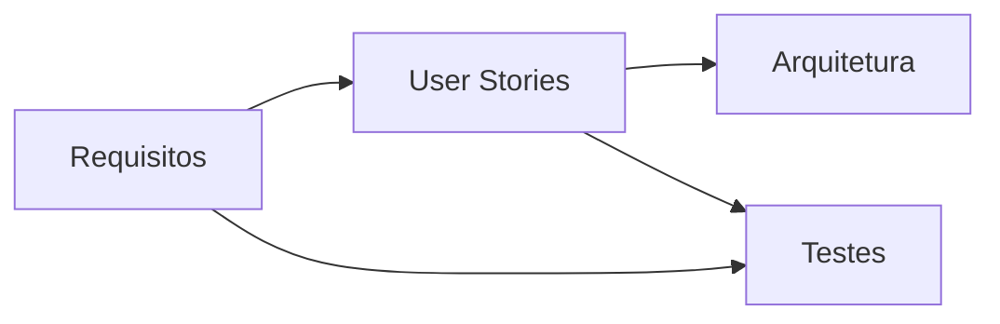
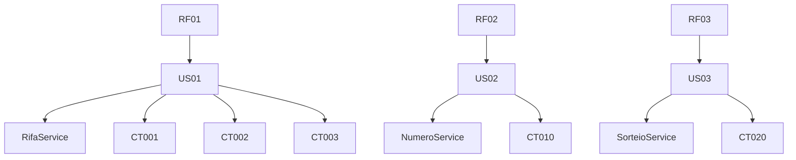

# Traceability Graph

O **Traceability Graph** apresenta a rastreabilidade entre os principais artefatos
de engenharia do sistema **Rifa Digital**.

Ele conecta:

- Requisitos (RF)
- User Stories (US)
- Componentes da Arquitetura
- Casos de Teste (CT)

Esse grafo permite entender **como cada requisito é implementado e validado**.

---

## Visão Conceitual

---

## Exemplo de Rastreabilidade

### Requisitos → User Stories

| Requisito | User Story |
|----------|------------|
| RF01 Criar rifa | US01 Criar campanha |
| RF02 Comprar número | US02 Reservar número |
| RF03 Realizar sorteio | US03 Executar sorteio |

---

### User Stories → Arquitetura

| User Story | Componente |
|-----------|-------------|
| US01 | RifaService |
| US02 | NumeroService |
| US03 | SorteioService |

---

### Requisitos → Testes

| Requisito | Casos de Teste |
|----------|----------------|
| RF01 | CT001, CT002, CT003 |
| RF02 | CT010 |
| RF03 | CT020 |

---

## Grafo de Rastreabilidade

---

## Benefícios da Rastreabilidade

O **Traceability Graph** permite:

- identificar quais testes validam cada requisito
- entender quais componentes implementam funcionalidades
- realizar análise de impacto em mudanças
- melhorar auditoria e governança da engenharia

---

## Navegação Relacionada

- [Engineering Map](engineering-map.md)
- [Knowledge Graph](knowledge-graph.md)
- [System Atlas](system-atlas.md)
- [Architecture Explorer](architecture-explorer.md)
