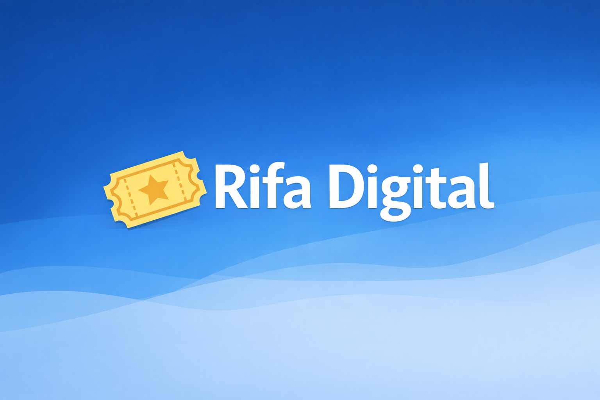
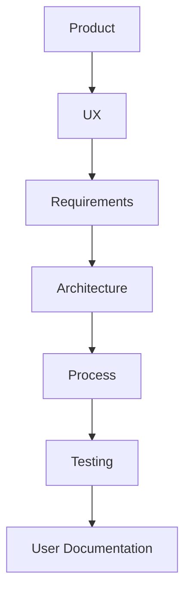

# 🎟️ Rifa Digital

Bem-vindo à documentação do sistema **Rifa Digital**.

Este projeto demonstra a engenharia completa de um sistema de software, incluindo:

- Produto
- UX
- Requisitos
- Arquitetura
- Processo de Desenvolvimento
- Testes
- Documentação de Usuário

---

## Engenharia do Sistema

A documentação está organizada seguindo boas práticas de **Engenharia de Software, Arquitetura e Qualidade de Software**.

---

## Navegação da Documentação

- :material-lightbulb-outline: **Product**

  Documentos relacionados à **visão do produto**.

  Conteúdo:
  - Visão do Produto
  - Roadmap
  - Stakeholders

  [➡ Acessar](product/README.md)

- :material-account-group: **UX**

  Documentação da **experiência do usuário**.

  Conteúdo:
  - Personas
  - Jornada do Usuário
  - Fluxos

  [➡ Acessar](ux/README.md)

- :material-file-document-outline: **Requirements**

  Engenharia de **levantamento e gestão de requisitos**.

  Conteúdo:
  - User Stories
  - Casos de Uso
  - Rastreabilidade

  [➡ Acessar](requirements/README.md)

- :material-sitemap: **Architecture**

  Arquitetura do sistema e modelagem técnica.

  Conteúdo:
  - System Overview
  - C4 Model
  - Modelo de Dados
  - Dicionário de Dados

  [➡ Acessar](architecture/README.md)

- :material-cogs: **Process**

  Processo de desenvolvimento adotado no projeto.

  Conteúdo:
  - Processo de Desenvolvimento
  - Práticas de Engenharia

  [➡ Acessar](process/processo-desenvolvimento.md)

- :material-test-tube: **Testing**

  Estratégia de **qualidade e testes de software**.

  Conteúdo:
  - Estratégia de Testes
  - Plano de Testes
  - Casos de Teste
  - Rastreabilidade

  [➡ Acessar](testing/README.md)

- :material-book-open-variant: **User**

  Documentação voltada ao **usuário final**.

  Conteúdo:
  - Manual do Usuário

  [➡ Acessar](user/manual-usuario.md)

---

## Sobre o Projeto

O **Rifa Digital** é um sistema desenvolvido para permitir a criação e gestão de rifas digitais.

Funcionalidades principais:

- criação de campanhas de rifa
- geração de números da rifa
- reserva de números por participantes
- confirmação de pagamento
- sorteio do vencedor

---

## Objetivo da Documentação

Esta documentação foi estruturada para demonstrar um projeto completo de engenharia de software, incluindo:

- **Product Management**
- **UX Design**
- **Requirements Engineering**
- **Software Architecture**
- **Software Testing (QA)**
- **User Documentation**

A organização segue práticas utilizadas por **equipes profissionais de desenvolvimento de software**.
