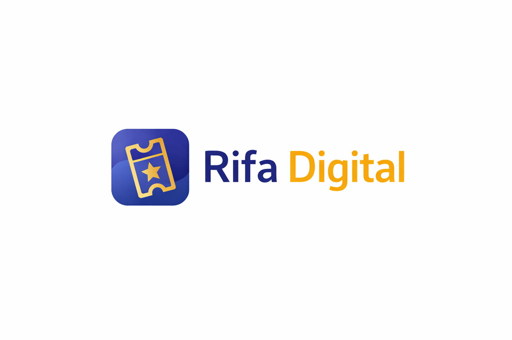
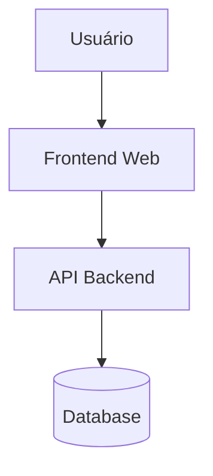

# Rifa Digital



## Plataforma de Rifa Digital

Sistema para criação e gerenciamento de **rifas digitais** utilizado para arrecadação de recursos para eventos e atividades escolares.

Este portal apresenta toda a engenharia do sistema, incluindo:

- Engenharia de requisitos
- Arquitetura de software
- Modelagem de dados
- Engenharia de testes
- Qualidade de software
- DevOps
- Observabilidade de engenharia

---

## 🚀 Quick Start

Clone o repositório:

```bash
git clone https://github.com/ivnavalenca/rifa-digital.git
cd rifa-digital
mkdocs serve
```

Acesse no navegador:

http://localhost:8000

---

## Arquitetura do Sistema



---

## Portal de Engenharia

### Product

- [Visão do Produto](product/visao-produto.md)
- [Stakeholders](product/stakeholders.md)
- [Roadmap](product/roadmap.md)

### UX

- [Personas](ux/personas.md)
- [Jornada do Usuário](ux/jornada-usuario.md)
- [Diagrama de Sequência](ux/sequencia.md)

### Requirements

- [Requisitos](requirements/requisitos.md)
- [Casos de Uso](requirements/casos-de-uso.md)
- [Priorização](requirements/priorizacao.md)
- [Rastreabilidade](requirements/rastreabilidade.md)

### Architecture

- [System Overview](architecture/system-overview.md)
- [Component Diagram](architecture/component-diagram.md)
- [Class Diagram](architecture/class-diagram.md)
- [Sequence Diagram](architecture/sequence-diagram.md)
- [C4 Model](architecture/c4-model.md)

### Data Architecture

- [Data Architecture](data/data-architecture.md)
- [MER](data/mer.md)
- [Modelo Relacional](data/modelo-relacional.md)
- [Schema SQL](data/schema-sql.md)
- [Dicionário de Dados](data/dicionario-dados.md)

### Testing

- [Estratégia de Testes](testing/estrategia-testes.md)
- [Plano de Testes](testing/plano-testes.md)
- [Casos de Teste](testing/casos-de-teste.md)
- [BDD Scenarios](testing/bdd-scenarios.md)
- [Test Execution Report](testing/test-execution-report.md)

### Quality

- [Plano de Qualidade](testing/plano-qualidade.md)
- [Quality Dashboard](testing/quality-dashboard.md)

### Engineering

- [Engineering Map](engineering/engineering-map.md)
- [Knowledge Graph](engineering/knowledge-graph.md)
- [Traceability Graph](engineering/traceability-graph.md)
- [Architecture Explorer](engineering/architecture-explorer.md)
- [System Atlas](engineering/system-atlas.md)
- [Interactive System Map](engineering/system-map.md)
- [3D Architecture Map](engineering/system-map-3d.md)
- [AI Engineering Assistant](engineering/assistant.md)

### Process

- [Processo de Desenvolvimento](process/processo-desenvolvimento.md)
- [Engineering Dashboard](process/engineering-dashboard.md)
- [Project Health](process/project-health.md)

### User

- [Manual do Usuário](user/manual-usuario.md)

---

## Sobre o Projeto

O sistema **Rifa Digital** foi desenvolvido como estudo de **Engenharia de Software**, contemplando:

- Engenharia de requisitos
- Arquitetura de software
- Modelagem de dados
- Engenharia de testes
- DevOps
- Observabilidade de engenharia
- Documentação técnica completa

---

## Repositório

Código disponível em:

https://github.com/ivnavalenca/rifa-digital
