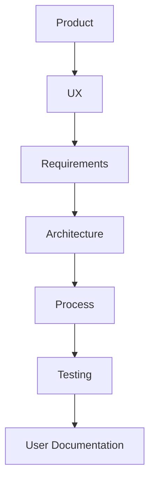

# Rifa Digital

Bem-vindo à documentação do sistema **Rifa Digital**.

Este projeto demonstra a engenharia completa de um sistema de software, incluindo:

- Produto
- UX
- Requisitos
- Arquitetura
- Processo de Desenvolvimento
- Testes

---

## Engenharia do Sistema

---

## Navegação da Documentação

- :material-lightbulb-outline: **Product**
  ---
  Visão do produto, stakeholders e roadmap.

  [:arrow_right: Acessar](product/README.md)

- :material-account-group: **UX**
  ---
  Personas, jornadas e fluxos de interação.

  [:arrow_right: Acessar](ux/README.md)

- :material-file-document-outline: **Requirements**
  ---
  User Stories, casos de uso e rastreabilidade.

  [:arrow_right: Acessar](requirements/README.md)

- :material-sitemap: **Architecture**
  ---
  Arquitetura do sistema e modelo de dados.

  [:arrow_right: Acessar](architecture/README.md)

- :material-cogs: **Process**
  ---
  Processo de desenvolvimento adotado.

  [:arrow_right: Acessar](process/processo-desenvolvimento.md)

- :material-test-tube: **Testing**
  ---
  Estratégia de testes e garantia de qualidade.

  [:arrow_right: Acessar](testing/README.md)

- :material-book-open-variant: **User**
  ---
  Manual de uso do sistema.

  [:arrow_right: Acessar](user/manual-usuario.md)

---

## Sobre o Projeto

O **Rifa Digital** é um sistema desenvolvido para permitir a criação e gestão de rifas digitais.

Funcionalidades principais:

- criação de campanhas
- seleção de números
- reserva de números
- confirmação de pagamento
- sorteio automático
