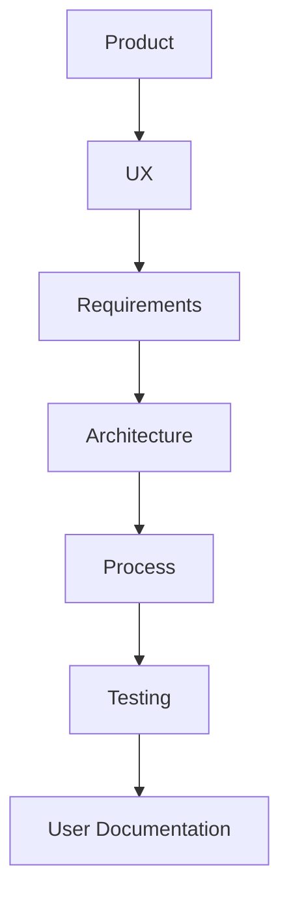

# Rifa Digital

Bem-vindo à documentação do sistema **Rifa Digital**.

Este projeto demonstra a engenharia completa de um sistema de software,
incluindo produto, UX, requisitos, arquitetura, processo de desenvolvimento
e testes.

---

# Estrutura da Documentação



---

## Product

Documentos relacionados à **visão do produto**.

Inclui:

- visão do produto
- roadmap
- stakeholders

Diretório:

```
product/
```

---

## UX

Documentos relacionados à **experiência do usuário**.

Inclui:

- personas
- jornada do usuário
- fluxos de interação

Diretório:

```
ux/
```

---

## Requirements

Documentação de **engenharia de requisitos**.

Inclui:

- user stories
- critérios de aceitação
- casos de uso
- rastreabilidade

Diretório:

```
requirements/
```

---

## Architecture

Documentação da **arquitetura do sistema**.

Inclui:

- visão geral do sistema
- arquitetura da aplicação
- modelo C4
- modelo de dados

Diretório:

```
architecture/
```

---

## Process

Documentação do **processo de desenvolvimento**.

Inclui:

- metodologia utilizada
- fluxo de desenvolvimento
- práticas adotadas pela equipe

Diretório:

```
process/
```

---

## Testing

Documentação de **qualidade e testes**.

Inclui:

- estratégia de testes
- plano de testes
- cenários BDD
- casos de teste
- execução de testes
- métricas de qualidade
- rastreabilidade

Diretório:

```
testing/
```

---

## User

Documentação voltada ao **usuário final do sistema**.

Inclui:

- manual do usuário
- instruções de uso do sistema

Diretório:

```
user/
```

---

# Navegação Recomendada

Sugere-se seguir a seguinte ordem de leitura:

1. Product
2. UX
3. Requirements
4. Architecture
5. Process
6. Testing
7. User

Essa sequência permite compreender o sistema desde a **visão do produto
até a validação por testes e uso do sistema**.
